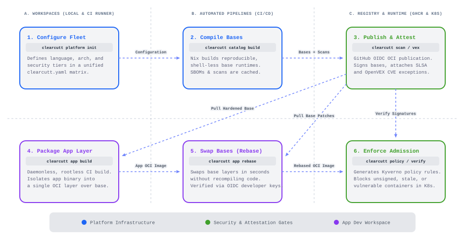

# ClearCutt

**A CLI for bootstrapping GitHub-native container image control planes: catalog,
release, signing, attestation, policy, and app-team adoption workflows generated
into your own repo.**

[](https://northcutted.github.io/clearcutt)
[](https://github.com/northcutted/clearcutt/actions/workflows/pr-gate.yml)
[](https://nixos.org)
[](https://slsa.dev)
[](https://sigstore.dev)
[](LICENSE)

ClearCutt is a free, open-source CLI for teams that want to own their container
image supply chain in a GitHub-native, git-based control-plane repository. Use
the CLI to generate the repo that owns catalog inputs, workflows, static
evidence portal publishing, CI/CD gates, admission policy examples, app-team
templates, release/signing/attestation paths, and remediation workflows under
**your** registry, GitHub Actions OIDC identities, and review process.

ClearCutt can govern image fleets it did not build. Start by importing existing
OCI images into a catalog, then add evidence, policy, app onboarding, and rebase
planning over time. If you later want full provenance and reproducible rebuilds,
graduate to a ClearCutt-operated fleet.

There is no hosted ClearCutt control plane. The generated repository is the
control plane: it owns configuration, builds or imported image inventory,
evidence, catalog, policies, and operational burden. The upstream
`northcutted/clearcutt` repository remains the CLI and reference implementation
source; direct forks remain an advanced/backward-compatible path.


## What It Is

ClearCutt is best understood as a **CLI that bootstraps user-owned container
image control planes**, not a hosted product. It provides the pieces a platform
team can render, configure, run, inspect, and adapt:

| Surface | What it does today | Owner |
| --- | --- | --- |
| Catalog-only control plane | Generates a lightweight Nix-free repo around `images.yaml`, catalog generation, validation, and static site publishing. | Platform team |
| Runtime base images | Publishes language runtime images in `dev`, `slim`, and `distroless` tiers. | Platform team |
| Service images | Publishes platform-owned service images such as Postgres, Valkey, and oauth2-proxy. | Platform team |
| Catalog and portal | Reports image metadata, evidence channels, vulnerability scans, tests, and missing data. | Platform team |
| App path | Gives app teams templates, devcontainers, local certification, app build, and rebase examples. | App teams |
| Trust controls | Provides signing, SBOM, provenance, policy, exception, VEX, and remediation examples. | Platform and security teams |

Nix is the backend build engine for platform-owned images. App teams consume the
fleet with Docker, Podman, Kubernetes, Cosign, and the ClearCutt CLI; they do
not need to learn Nix.



## First Proof From A Clean Clone

These commands use the committed catalog fixture, so they work before you
generate or publish your own catalog data:

```bash
go -C cli run ./cmd/clearcutt --catalog internal/testdata/catalog list
go -C cli run ./cmd/clearcutt --catalog internal/testdata/catalog inspect java21-distroless
go -C cli run ./cmd/clearcutt --catalog internal/testdata/catalog catalog validate

go -C cli run ./cmd/clearcutt --catalog internal/testdata/catalog verify image java21-distroless \
  --require-signature \
  --require-sbom \
  --require-provenance \
  --max-critical 0 \
  --max-high 3 \
  --allow-preview
```

`verify image` is a catalog policy gate. It checks catalog-record evidence flags,
smoke tests, lifecycle status, and vulnerability thresholds. Use
`verify release-evidence`, Cosign, GitHub attestations, and SLSA verification
when you need registry-side cryptographic proof for a published OCI ref.

## Install

Each release publishes cross-compiled CLI binaries named
`clearcutt-<os>-<arch>` for `darwin`, `linux`, and `windows` on `amd64` and
`arm64`, a keyless Sigstore signature bundle (`<binary>.sig`) for each, and a
`SHA256SUMS.txt` checksum manifest. Download the binary for your platform and
its `.sig` bundle from the
[latest release](https://github.com/northcutted/clearcutt/releases/latest),
then verify the signature before running anything:

```bash
# Example assets: Apple Silicon macOS. Pick the pair matching your OS/arch.
cosign verify-blob \
  --bundle clearcutt-darwin-arm64.sig \
  --certificate-identity 'https://github.com/northcutted/clearcutt/.github/workflows/release.yml@refs/heads/main' \
  --certificate-oidc-issuer https://token.actions.githubusercontent.com \
  clearcutt-darwin-arm64

chmod +x clearcutt-darwin-arm64
```

The certificate identity is the release workflow pinned to `refs/heads/main` —
the same identity recorded in `clearcutt.fleet.yaml` and matched exactly by
`clearcutt verify release-evidence`. From a repo clone, the verified binary
runs the same fixture-backed first proof as above:

```bash
./clearcutt-darwin-arm64 --catalog cli/internal/testdata/catalog list
```

Building from source stays the contributor path; see
[CONTRIBUTING.md](CONTRIBUTING.md) and the clean-clone proof above.

## Where To Start

| Role | First document | First useful command |
| --- | --- | --- |
| App developer | [Getting started](docs/getting-started.md) | `go -C cli run ./cmd/clearcutt --catalog internal/testdata/catalog inspect java21-distroless` |
| Imported fleet owner | [Imported fleets](docs/imported-fleets.md) | `go -C cli run ./cmd/clearcutt import images --refs ../examples/imported-fleet/refs.txt --output /tmp/clearcutt-import/images.yaml --force` |
| Platform owner | [Platform bootstrap](docs/platform-kit.md) | `go -C cli run ./cmd/clearcutt platform bootstrap github --profile catalog-only --owner YOUR_ORG --repo image-platform --registry-base ghcr.io/YOUR_ORG/image-platform --dir ./image-platform --dry-run --force` |
| Security or auditor | [Trust evidence walkthrough](docs/trust/evidence-walkthrough.md) | `go -C cli run ./cmd/clearcutt --catalog internal/testdata/catalog verify image java21-distroless --require-signature --require-sbom --require-provenance --allow-preview` |
| Engineering manager | [Alternatives and fit](docs/alternatives.md) | `sed -n '1,120p' docs/alternatives.md` |
| Open-source evaluator | [Demo path](docs/demo.md) | `go -C cli run ./cmd/clearcutt --catalog internal/testdata/catalog list` |

For a deterministic imported-fleet proof that does not require Nix or registry
access:

```bash
# Offline deterministic demo
./scripts/demo-imported-fleet-offline.sh

# The script prints a unique output directory. To use a fixed path:
OUT=/tmp/clearcutt-import-demo ./scripts/demo-imported-fleet-offline.sh
cat /tmp/clearcutt-import-demo/imported-fleet-report.md
```

ClearCutt can govern imported images without trusting them by default. It
records what can be observed, preserves missing evidence, and only treats
provenance as verified when actual provenance evidence exists.

The full documentation index is [docs/README.md](docs/README.md).

Contributor note: if the platform-source drift check fails, refresh the
embedded source archive with:

```bash
go -C cli run ./internal/platformsource/internal/genplatformsource
```

## Portal Preview

These screenshots are generated from the committed mixed catalog fixture, not
from ignored local site data.


## Proof Map

- [Mental model](docs/concepts/mental-model.md) explains the two loops:
  platform teams publish the fleet; app teams adopt, gate, admit, and update.
- [Glossary](docs/concepts/glossary.md) defines lanes, tiers, evidence,
  certification, verification, exceptions, VEX, rebase, preview, and scaffold.
- [CLI reference](docs/cli-reference.md) maps the current command surface.
- [Catalog generator](docs/catalog-generator.md) explains generated catalog
  data, raw evidence directories, validation, and generic OCI mode.
- [Catalog evidence walkthrough](docs/trust/catalog-evidence.md) explains what
  the portal proves, what it only reports, and how missing evidence appears.
- [Security model](docs/security-model.md) documents trust boundaries and
  non-claims.
- [Policy bundles](docs/policy-bundles.md) covers Kyverno and Gatekeeper policy
  generation.
- [Fork validation](docs/fork-validation.md) lists checks to run before an advanced fork's
  first release.

## Repo Layout

| Workspace | Purpose |
| --- | --- |
| `core/` | Nix image factory, runtime overlays, release pipeline, scans, and conformance tests. |
| `cli/` | Go governance CLI and tests. |
| `site/` | Astro catalog portal and generated-site template source. |
| `docs/` | Role-routed documentation, trust walkthroughs, and operating guides. |
| `examples/` | App templates, deployment manifests, policy examples, and overlays. |
| `.github/` | Release, catalog, Pages, remediation, PR, and rebase workflows. |

## Boundaries

ClearCutt is pre-1.0 and intentionally conservative in its claims. The reference
repo demonstrates a production-oriented blueprint, but fork owners must operate
their own registry, workflow identities, release approvals, catalog data,
admission policies, exception process, and remediation defaults.

Use ClearCutt when owning the full image supply chain is the point. Do not use
it when you primarily want a vendor SLA, hosted control plane, fully managed
patch stream, or FIPS/STIG certification out of the box.

## Security

See [SECURITY.md](SECURITY.md) for the supported-release policy and how to
report vulnerabilities privately.
