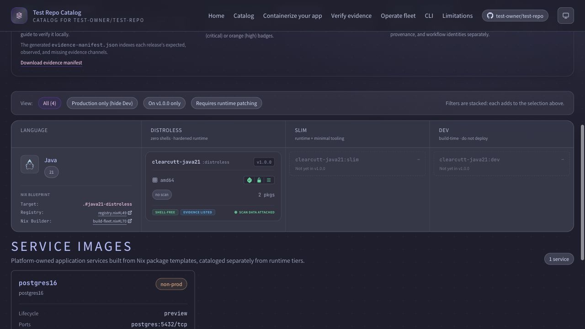
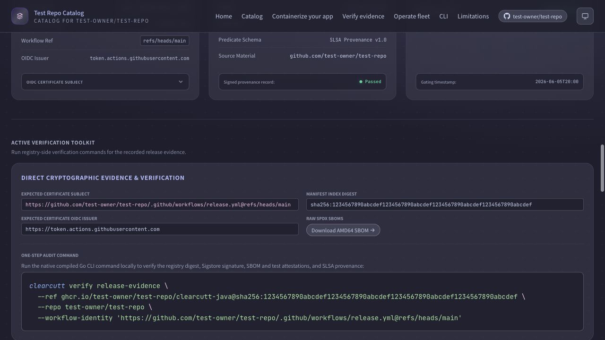

# ClearCutt Reviewer Demo

This demo path is designed for a clean checkout. Steps marked "fixture-backed"
use committed catalog data. Steps marked "live" require a fork, registry, or
local container tooling.


## 1. Explain The Project

```bash
sed -n '1,140p' README.md
sed -n '1,120p' docs/README.md
```

Expected readout: ClearCutt is a forkable platform kit/reference
implementation, the repo is the control plane, and roles have different first
paths.

## 2. Fixture-Backed Catalog Proof

```bash
go -C cli run ./cmd/clearcutt --catalog internal/testdata/catalog list
go -C cli run ./cmd/clearcutt --catalog internal/testdata/catalog inspect java21-distroless
go -C cli run ./cmd/clearcutt --catalog internal/testdata/catalog verify image java21-distroless \
  --require-signature \
  --require-sbom \
  --require-provenance \
  --allow-preview
```

Expected readout: the CLI can list, inspect, and gate catalog data without
generated artifacts.

## 3. App-Team Path

```bash
go -C cli run ./cmd/clearcutt app template java \
  --fleet-config ../clearcutt.fleet.yaml \
  --output /tmp/clearcutt-demo-app \
  --name payments-api \
  --force
sed -n '1,120p' /tmp/clearcutt-demo-app/README.md
```

Expected readout: the generated app contains a Dockerfile, devcontainer,
certification policy, release workflow, and rebase workflow.

## 4. Catalog Portal Build

```bash
go -C cli run ./cmd/clearcutt catalog site build \
  --catalog internal/testdata/mixed-catalog \
  --template ../site \
  --output /tmp/clearcutt-demo-site \
  --install
```

Expected readout: static HTML renders from fixture catalog data, including
service records and image detail pages.

Fixture-backed portal screenshots:





## 5. Live Trust Walkthrough

Use [trust/evidence-walkthrough.md](trust/evidence-walkthrough.md) after a fork
has published at least one release. The fixture screenshots above prove local
rendering and catalog wiring; a fork owner should additionally compare them with
the live Pages site for that fork's current registry, OIDC subject, signatures,
SBOMs, provenance, scans, tests, and exception records.

## Feedback Questions

- Can the reviewer explain what ClearCutt is in one minute?
- Can they tell what is fixture-backed versus live registry proof?
- Can an app developer find the template/dev/certify path without learning Nix?
- Can a security reviewer trace a release identity from config to policy?
- Can a platform owner see what their fork must operate?
