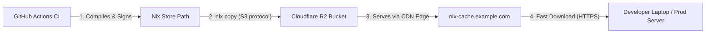

# Declarative Nix Binary Cache via Cloudflare R2

This document provides instructions for establishing a high-performance custom Nix binary cache for a ClearCutt-powered fleet using Cloudflare R2 and your own cache domain. Cloudflare R2 is commonly used to avoid provider egress charges, but verify current pricing for your account before relying on that assumption.

---

## Architecture Overview



By placing Cloudflare's CDN in front of an R2 bucket on your cache domain, compiled Nix packages (even huge closures like LLVM, GCC, or custom JDKs) are distributed globally in milliseconds. Because R2 has **zero egress fees**, developers can pull gigabytes of caches daily without generating AWS-style bandwidth bills.

---

## Setup Guide

### Step 1: Create R2 Bucket & Configure Custom Domain
1. Log in to your **Cloudflare Dashboard**.
2. Navigate to **R2** in the left sidebar and click **Create Bucket**.
   * **Bucket Name:** `YOUR_FLEET_NIX_CACHE_BUCKET`
3. Click on the newly created bucket, go to the **Settings** tab.
4. Scroll to **Public Access** -> **Custom Domains**.
5. Click **Connect Domain** and enter:
   * **Domain:** `nix-cache.example.com`
6. Click **Continue**. Cloudflare will automatically configure the DNS records and provision a managed SSL certificate.

---

### Step 2: Generate Nix Cache Signing Keys
To prevent malicious or tampered packages from being downloaded from the cache, Nix requires all binary store paths to be signed.

Run the following command on your local machine to generate the cryptographic keypair:
```bash
nix-store --generate-binary-cache-key your-fleet-cache-1 cache-secret-key.pem cache-public-key.pem
```

* **Private Key File (`cache-secret-key.pem`):** Keep this extremely secure. You will save its contents as a GitHub Repository Secret.
* **Public Key File (`cache-public-key.pem`):** This is safe to publish. Developers will use it to verify downloads.

---

### Step 3: Configure GitHub Actions Secrets
In your GitHub repository, navigate to **Settings** -> **Secrets and variables** -> **Actions** and add the following repository secrets:

1. `NIX_CACHE_SECRET_KEY`: The exact multiline contents of your `cache-secret-key.pem`.
2. `R2_ACCESS_KEY_ID`: Cloudflare R2 Access Key ID (generated under Cloudflare -> R2 -> Manage R2 API Tokens).
3. `R2_SECRET_ACCESS_KEY`: Cloudflare R2 Secret Access Key.
4. `CLOUDFLARE_ACCOUNT_ID`: Your 32-character Cloudflare Account ID (visible on the R2 homepage).
5. `CLOUDFLARE_API_TOKEN`: (Optional) Cloudflare token allowed to purge the public cache URL after upload.
6. `CLOUDFLARE_ZONE_ID`: (Optional) Your 32-character Cloudflare Zone ID (visible on your domain's Overview homepage). Providing this is highly recommended as it avoids requiring the `CLOUDFLARE_API_TOKEN` to have account-wide `Zone:Zone:Read` lookup permissions.

---

### Step 4: Configure `clearcutt.yaml`

The release workflow does not hardcode bucket names. It calls
`clearcutt fleet publish-cache`, which reads cache coordinates from
`clearcutt.yaml` and skips cleanly when the config or secrets are absent:

```yaml
release:
  nixCache:
    bucket: YOUR_FLEET_NIX_CACHE_BUCKET
    publicBaseUrl: https://nix-cache.example.com
    signingKeyName: your-fleet-cache-1
    publicKey: your-fleet-cache-1:YOUR_PUBLIC_KEY_CONTENT_HERE
    cloudflareZoneName: example.com
```

For an already-built target, the equivalent local command is:

```bash
clearcutt fleet publish-cache \
  --system x86_64-linux \
  --language java21 \
  --tier slim \
  --core-dir core
```

---

### Step 5: Configure Clients (Developers & Servers)
To instruct developer laptops or deployment servers to download pre-compiled
binaries from your R2 CDN cache, let the CLI write the user-level Nix client
config from `clearcutt.yaml`:

```bash
clearcutt platform setup-nix --core-dir core --write-user-config
```

In GitHub Actions, the workflows use the same command with
`--github-env "$GITHUB_ENV"` so later `nix` commands inherit the generated
`NIX_CONFIG` without hardcoding the upstream ClearCutt cache in workflow YAML.

The generated config is equivalent to:
```conf
substituters = https://cache.nixos.org https://nix-cache.example.com
trusted-public-keys = cache.nixos.org-1:6NCHdD59X431o0gWypbMrAURkbJ16ZPMQFGspcDShjY= your-fleet-cache-1:YOUR_PUBLIC_KEY_CONTENT_HERE
```

Replace `YOUR_PUBLIC_KEY_CONTENT_HERE` with the public trusted key from
`cache-public-key.pem`. This is safe to commit to `clearcutt.yaml`; only
`cache-secret-key.pem` belongs in the `NIX_CACHE_SECRET_KEY` GitHub secret.

---

## Security Analysis

* **Signed-cache trust boundary:** If an attacker uploads modified store paths without the configured cache signing key, Nix clients should reject those paths during signature verification. Protect the signing key as the trust boundary.
* **Zero Egress Fees:** Because Cloudflare R2 has zero bandwidth fees for downloading data out of R2 to the internet, you can distribute massive, compiler-heavy dependencies to unlimited CI runners or developers without incurring any cost.
