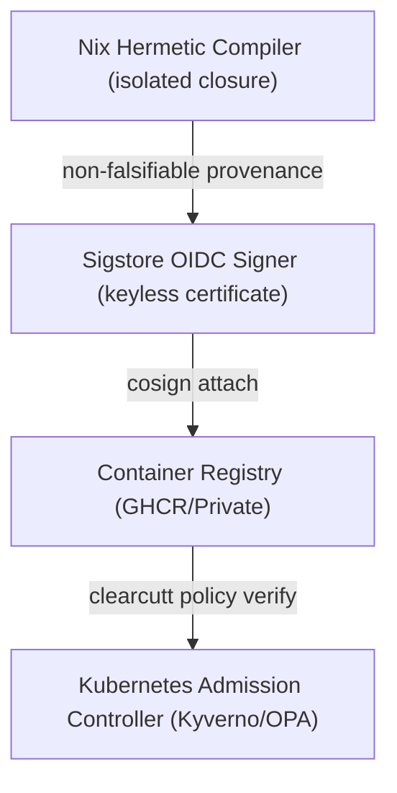

# ClearCutt Security Model & Trust Boundaries

This document defines the supply-chain security model, trust boundaries, and evidence validation systems implemented by the ClearCutt base-image catalog and gating platform.

---

## 1. Core Security Guarantees
ClearCutt is designed to establish reliable, evidence-backed supply-chain assurances for base images through three primary pillars:
- **Digest-Pinned References**: All runtime dependencies and base images are cryptographic digest-pinned to prevent dynamic tag mutation and ensure byte-for-byte reproducibility.
- **Keyless Signature & SLSA Provenance Verification**: Releases are cryptographically signed using Sigstore Cosign keyless signatures and attested with SLSA level-3 non-falsifiable build provenance.
- **Minimality & Hardening**:
  - `distroless` tier is guaranteed shell-free, package-manager-free, and executes under a strict unprivileged operator (`UID 10001:10001`).
  - `slim` tier is package-manager-free and executes under a non-root UID while retaining an interactive shell.

---

## 2. Supply-Chain Trust Boundaries

### 2.1 Build-Time Assumptions
- The Nix store compilation pipeline compiles and layers all runtime interpreters inside a completely hermetic closure. 
- All dynamic linkage paths are RPATH/RUNPATH bound directly to `/nix/store` entries, bypassing host path resolution and preventing dynamic linkage hijacking.

### 2.2 Registry & Distribution Boundaries
- Cryptographic signatures and SPDX SBOMs are stored alongside container images as OCI referrers.
- Admission controllers must query and verify signature certs (`subject` and `issuer`) before scheduling pods.

---

## 3. Security Model Limitations & Non-Claims
To remain precise and conservative:
- **No FIPS Cryptographic Claims**: ClearCutt runtimes use standard upstream cryptographic modules and do not assert FIPS validation unless an explicit cryptographic module boundary has been formally certified.
- **No Zero Risk Guarantees**: While vulnerability exception models enable structured patch governance, vulnerability scans only represent findings at a discrete point in time and do not guarantee an absence of future security defects.
- **BYO Base Image Overlays Limitation**: Overlay images grafted onto mandated corporate operating systems (e.g., Red Hat UBI or AL2023) **do not** inherit ClearCutt's distroless zero-utility guarantee. They retain the parent base image's shell, package manager, and CVE footprint.
