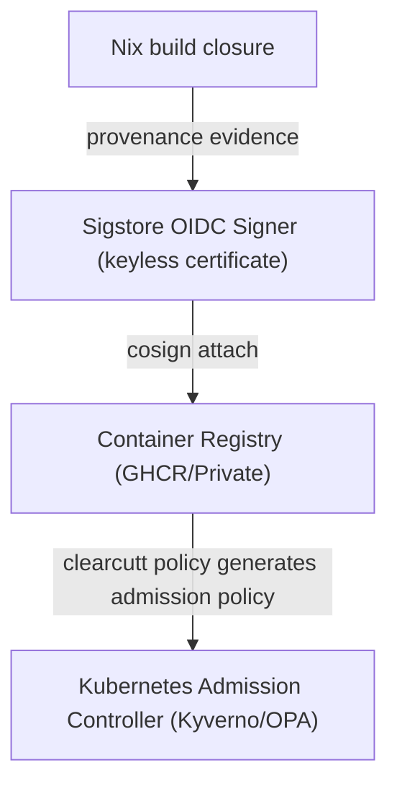

# ClearCutt Security Model & Trust Boundaries

This document defines the supply-chain security model, trust boundaries, and evidence validation systems implemented by the ClearCutt base-image catalog and gating platform.

For a command-level path through one image digest, use
[`trust/evidence-walkthrough.md`](trust/evidence-walkthrough.md). For catalog
badge semantics and missing-evidence states, use
[`trust/catalog-evidence.md`](trust/catalog-evidence.md).

---

## 1. Core Security Assurances
ClearCutt is designed to establish reliable, evidence-backed supply-chain assurances for base images through three primary pillars:
- **Digest-Pinned References**: ClearCutt records immutable image digests when release/catalog evidence is available and uses Nix-locked platform inputs for the reference build path. Fork owners should treat any mutable external tag as a configuration gap.
- **Keyless Signature & SLSA Provenance Evidence**: The release workflow is configured to sign published images with Sigstore Cosign keyless signatures and attach SLSA provenance evidence. Use registry-side verification commands for cryptographic proof; catalog gates report whether that evidence is recorded for a release.
- **Minimality & Hardening**:
  - `distroless` tier is verified by conformance/certification checks to be shell-free, package-manager-free, and configured for unprivileged execution (`UID 10001:10001`).
  - `slim` tier is package-manager-free and executes under a non-root UID while retaining an interactive shell.

---

## 2. Supply-Chain Trust Boundaries

### 2.1 Build-Time Assumptions
- The Nix store compilation pipeline constrains runtime interpreters and their declared inputs inside a Nix build closure.
- All dynamic linkage paths are RPATH/RUNPATH bound directly to `/nix/store` entries, bypassing host path resolution and preventing dynamic linkage hijacking.

### 2.2 Registry & Distribution Boundaries
- Cryptographic signatures and SPDX SBOMs are stored alongside container images as OCI referrers.
- Admission controllers must query and verify signature certs (`subject` and `issuer`) before scheduling pods.

### 2.3 Downstream Rebase Boundaries
The downstream application lifecycle commands add a separate, explicit trust
boundary around application payloads:
- `clearcutt app build` records the digest-pinned base reference and the
  compressed digest of the final base layer in OCI config labels.
- `clearcutt app rebase` refuses images that are not marked rebasable, refuses a
  base-boundary mismatch, and preserves every application layer descriptor after
  that boundary.
- The compatibility gate allows only the same runtime family and major/minor
  line, so patch-level base upgrades are allowed while runtime ABI jumps are
  blocked.
- Before an `allowed` rebase attestation is emitted, the rebase workflow verifies
  the original developer signature over the digest-pinned source image.
- The rebased image is signed by the rebase-engine workflow, and the rebase
  predicate is attached as a signed in-toto/cosign attestation.

This does not make the rebase engine magically outside the trusted computing
base. The engine is still trusted to perform the developer-signature verification
and to sign the resulting predicate honestly, so production admission policy
must pin the rebase-engine identity tightly and inspect the predicate fields.

---

## 3. Security Model Limitations & Non-Claims
To remain precise and conservative:
- **No FIPS Cryptographic Claims**: ClearCutt runtimes use standard upstream cryptographic modules and do not assert FIPS validation unless an explicit cryptographic module boundary has been formally certified.
- **No Zero Risk Guarantees**: While vulnerability exception models enable structured patch governance, vulnerability scans only represent findings at a discrete point in time and do not guarantee an absence of future security defects.
- **BYO Base Image Overlays Limitation**: Overlay images grafted onto mandated corporate operating systems (e.g., Red Hat UBI or AL2023) **do not** inherit ClearCutt's distroless zero-utility guarantee. They retain the parent base image's shell, package manager, and CVE footprint.
- **Main-Only Reference Release Identity**: The upstream reference policy pins
  release evidence to `.github/workflows/release.yml@refs/heads/main`. Forks
  that release from additional refs must update fleet config, policy, and
  verifier commands together.
