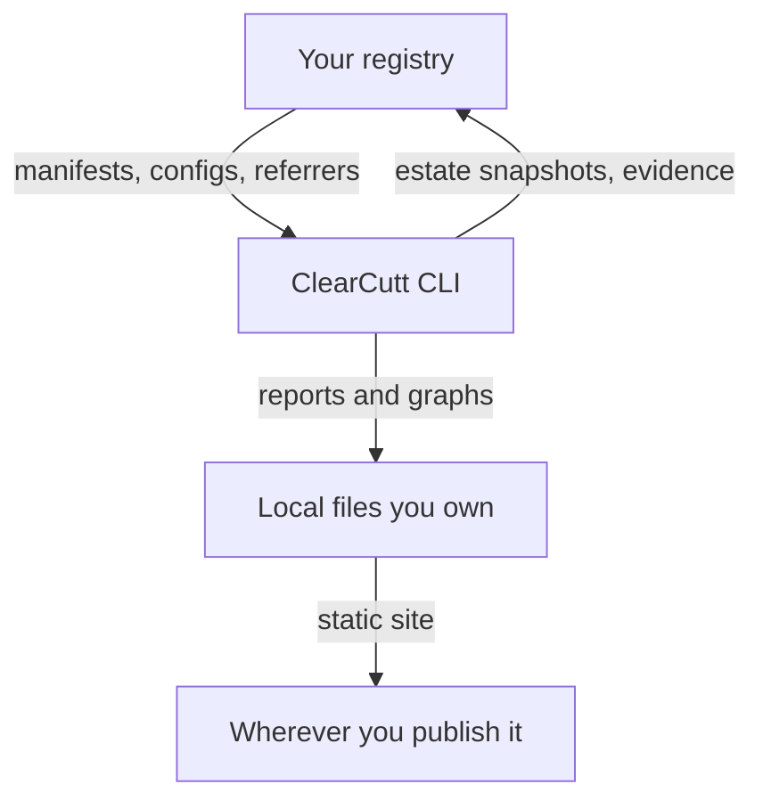

# ClearCutt Security Model

ClearCutt is a governance CLI. It reads registries, derives relationships from
what it finds, and writes reports and artifacts. **It does not build, patch,
sign, or publish container images.** Everything below is scoped to that.

An earlier version of this document described the security properties of images
ClearCutt built and published. That capability was removed; the document has
been rewritten rather than trimmed, because a security model that describes a
product you do not ship is worse than none.

## 1. What ClearCutt does to your infrastructure

**Reads, by default.** `registry scan`, `import observe`, `graph`, `scan` and
`certify` list tags and fetch manifests, configs and — only when asked —
attached SBOMs. They pull no image layers, mutate nothing, and publish nothing.

**Writes, only when told.** Three commands write to a registry, and each takes
an explicit reference:

| command | writes | scope |
| --- | --- | --- |
| `estate push` | a snapshot artifact, and optionally a history index | the reference you name |
| `evidence attach` | an evidence bundle attached to an image digest | the subject's repository |
| `evidence import` | restores previously exported bundles | the repository you name |

Nothing else in the CLI writes to a registry.

**Credentials.** Explicit environment credentials are preferred
(`REGISTRY_USER`/`REGISTRY_TOKEN`, then `CLEARCUTT_REGISTRY_*`, then
`GITHUB_*`), falling back to the ambient Docker keychain. ClearCutt never
persists credentials and never writes them into reports.

## 2. Trust boundaries

The load-bearing boundary is **between what ClearCutt proves and what it
repeats.**

- **Proof.** A `layer-prefix` base relationship is a fact about bytes: the
  consumer begins with exactly the base's layer digests. Content-identical
  groups, shared-layer blast radius, and Nix package sets read out of an image
  config are the same kind of statement.
- **Claim.** `oci-base-digest`, `buildpacks-metadata`, `oci-base-name` and
  `history` all originate with whoever built the image. ClearCutt reports them,
  labels them as assisted rather than verified, and never lets a claim outrank
  layer evidence.
- **Unknown.** An image whose provenance cannot be established is reported as
  undetermined with the reason. Absence is never rendered as zero.

Evidence ClearCutt reads — SBOMs, signatures, attestations — is evidence
**someone else produced**. ClearCutt records whether it is present and
well-formed. Verifying it cryptographically is `verify release-evidence`,
cosign, and SLSA verification, against the registry.

## 3. Registry-native storage

Estate snapshots and evidence bundles are OCI artifacts in your registry. Two
consequences you own:

- **Garbage collection.** An attachment is a manifest, and lifecycle rules can
  delete it. The referrers tag fallback protects against untagged-manifest
  pruning but not age- or count-based rules. `evidence export` exists so a copy
  can live somewhere with its own retention guarantees.
- **Tag mutability.** The history index and the `sha256-*` referrer tags are
  rewritten in place and require mutable tags. Snapshots, evidence bundles and
  release images are write-once.

If the registry is the thing being audited, storing the audit inside it is a
mild conflict of interest. Sign the artifacts.

See [registry-native evidence](registry-native-evidence.md).

## 4. Non-claims

- **ClearCutt does not make images safe.** It reports what is there. It cannot
  patch, rebuild, or re-tag anything.
- **A scan is a point in time.** Findings reflect the scanner's database at the
  moment it ran.
- **A vulnerability acceptance is not a suppression.** An accepted finding stays
  in the scan output and in the report, carries a named owner and an expiry, and
  blocks exactly as hard as an unaccepted one once it expires.
- **Coverage is not proof.** An estate can raise the share of images with a
  known base by adding labels to its own images. Only layer evidence raises the
  proven share, which is why the two are reported separately.
- **ClearCutt trusts your registry credentials, not your registry.** It will
  faithfully report a compromised image as present; it does not detect tampering
  beyond what signatures and digests already establish.
- **No FIPS or certification claims** of any kind.
