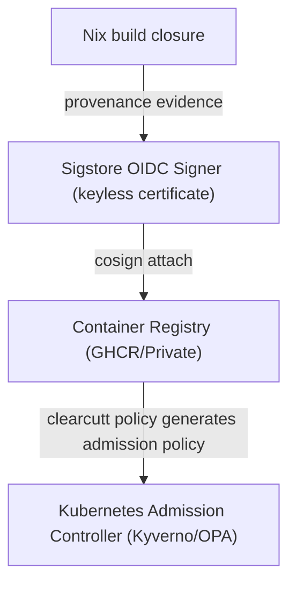

# ClearCutt Security Model & Trust Boundaries

This document defines the supply-chain security model, trust boundaries, and evidence validation systems implemented by the ClearCutt base-image catalog and gating platform.

For a command-level path through one image digest, use
[`trust/evidence-walkthrough.md`](trust/evidence-walkthrough.md). For catalog
badge semantics and missing-evidence states, use
[`trust/catalog-evidence.md`](trust/catalog-evidence.md). For the remediation
drafting agent boundary, use
[`trust/cve-agent-threat-model.md`](trust/cve-agent-threat-model.md).

---

## 1. Core Security Assurances
ClearCutt is designed to establish reliable, evidence-backed supply-chain assurances for base images through four primary pillars:
- **Digest-Pinned References**: ClearCutt records immutable image digests when release/catalog evidence is available and uses Nix-locked platform inputs for the reference build path. Fork owners should treat any mutable external tag as a configuration gap.
- **Keyless Signature & SLSA Provenance Evidence**: The release workflow is configured to sign published images with Sigstore Cosign keyless signatures and attach SLSA provenance evidence. Use registry-side verification commands for cryptographic proof; catalog gates report whether that evidence is recorded for a release.
- **Minimality & Hardening**:
  - `distroless` tier is verified by conformance/certification checks to be shell-free, package-manager-free, and configured for unprivileged execution (`UID 10001:10001`).
  - `slim` tier is package-manager-free and executes under a non-root UID while retaining an interactive shell.
- **Risk-Based Vulnerability Posture**: Production-tier images carry no *reachable, materially-risky, fixable* CVE that the platform has left unaddressed.
  - *Reachable* = present in the shipped runtime closure, enforced by `closure-cve-check` against a policy-derived runtime floor (not exploitability/call-graph reachability — a deliberately conservative, over-including proxy).
  - *Materially risky* = CISA KEV-listed, **or** EPSS percentile ≥ the configured threshold, **or** severity ≥ the configured floor. KEV and EPSS scores are authoritative and dated in-record (CISA / FIRST.org), not ClearCutt's opinion.
  - *Fixable* = an upstream fixed version exists.
  - Every finding the policy does not require fixing is auto-recorded as an owned, time-boxed, **expiring** acceptance (OpenVEX) — visible in the catalog, re-evaluated each scan, never silently tolerated. A finding that is reachable and materially risky but has **no** upstream fix blocks until an explicit, expiring acknowledgement is recorded.
  - The thresholds live in `clearcutt.fleet.yaml` `remediation.policy` (reachability, KEV, EPSS percentile, severity floor, expiry). Forks tune the **thresholds**, never per-package waivers; `kev: always` is non-loosenable for the crypto floor.

---

## 2. Supply-Chain Trust Boundaries

### 2.1 Build-Time Assumptions
- The Nix store compilation pipeline compiles and layers all runtime interpreters inside a completely hermetic closure.
- Distroless runtime images omit FHS linker/library fallback paths and rely on RPATH/RUNPATH entries bound directly to `/nix/store`.
- Slim, dev, and service images retain `/lib`/`/lib64` compatibility symlinks for teams that need to run FHS-oriented binaries inside a ClearCutt-managed runtime. Treat those tiers as compatibility tiers, not as the strictest dynamic-linkage boundary.
- Only the dev tier additionally sets `LD_LIBRARY_PATH=/lib:/lib64:/usr/lib:/usr/lib64` as a foreign-binary convenience. Production tiers (slim, distroless) and service images never set it: glibc resolves libraries in the order `DT_RPATH` > `LD_LIBRARY_PATH` > `DT_RUNPATH`, and Nix-built binaries record their store-bound dependencies in `DT_RUNPATH`, so a global FHS `LD_LIBRARY_PATH` would outrank hermetic store resolution on every binary in the image — the same drift class the RPATH/interpreter gate exists to prevent. The `/lib`/`/lib64` symlinks alone cover FHS foreign binaries through the dynamic loader's default search paths without overriding `DT_RUNPATH`. The absence of `LD_LIBRARY_PATH` in production OCI configs is machine-checked by `core/tests/verify.sh` (runtime images) and `core/tests/service-image-contract.sh` (service images).
- The RPATH/interpreter gate verifies the binaries in the Nix closure; it does not claim that a downstream application cannot add new dynamic-linkage paths after the image is extended.

### 2.1.1 License Metadata Boundary
- The source recipes and CLI/site code are Apache-2.0, but released images contain third-party packages from nixpkgs with mixed upstream licenses.
- OCI image labels therefore use `org.opencontainers.image.licenses=NOASSERTION` for the image artifact and `dev.clearcutt.recipe.license=Apache-2.0` for the ClearCutt recipe layer.
- The SPDX SBOM is the source of package-level license evidence for a concrete image digest.

### 2.1.2 Closure-Diff Baseline
- The G2 remediation gate compares the current image's extracted `/nix/store`
  roots with a registry-derived known-good image, not with the image being
  tested.
- The default baseline is the upstream `coreLTS-slim` rolling image
  (`ghcr.io/northcutted/clearcutt/clearcutt-corelts:slim`) and the default
  package boundary is `bash-interactive`.
- Forks and offline test fixtures can set `CLEARCUTT_G2_KNOWN_GOOD_REF`,
  `CLEARCUTT_G2_KNOWN_GOOD_ARCH`, `CLEARCUTT_G2_KNOWN_GOOD_CLOSURE`, and
  `CLEARCUTT_G2_TARGET_PACKAGE` to compare against their own release baseline
  and patched package.

### 2.2 Registry & Distribution Boundaries
- Cryptographic signatures and SPDX SBOMs are stored alongside container images as OCI referrers.
- Admission controllers must query and verify signature certs (`subject` and `issuer`) before scheduling pods.

### 2.3 Downstream Rebase Boundaries
The downstream application lifecycle commands add a separate, explicit trust
boundary around application payloads:
- `clearcutt app build` records the digest-pinned base reference and the
  compressed digest of the final base layer in OCI config labels.
- `clearcutt app rebase` refuses images that are not marked rebasable, refuses a
  base-boundary mismatch, and preserves every application layer descriptor after
  that boundary.
- The compatibility gate allows only the same runtime family and major/minor
  line, so patch-level base upgrades are allowed while runtime ABI jumps are
  blocked.
- Before an `allowed` rebase attestation is emitted, the rebase workflow verifies
  the original developer signature over the digest-pinned source image.
- The rebased image is signed by the rebase-engine workflow, and the rebase
  predicate is attached as a signed in-toto/cosign attestation.

This does not make the rebase engine magically outside the trusted computing
base. The engine is still trusted to perform the developer-signature verification
and to sign the resulting predicate honestly, so production admission policy
must pin the rebase-engine identity tightly and inspect the predicate fields.

---

## 3. Security Model Limitations & Non-Claims
To remain precise and conservative:
- **No FIPS Cryptographic Claims**: ClearCutt runtimes use standard upstream cryptographic modules and do not assert FIPS validation unless an explicit cryptographic module boundary has been formally certified.
- **No Zero Risk Guarantees**: Vulnerability scans only represent findings at a discrete point in time and do not guarantee an absence of future security defects. The production posture in §1 is risk-scoped, not absolute: it asserts that no *reachable, materially-risky, fixable* CVE is left unaddressed — it does **not** claim zero known CVEs. Findings below the materiality bar, or confined to unreachable base layers, are accepted by policy and recorded as owned, time-boxed, expiring exceptions (re-evaluated each scan) rather than silently tolerated. The single trust surface is the threshold configuration itself, which lives in a reviewed config file — never per-finding, never hidden.
- **BYO Base Image Overlays Limitation**: Overlay images grafted onto mandated corporate operating systems (e.g., Red Hat UBI or AL2023) **do not** inherit ClearCutt's distroless zero-utility guarantee. They retain the parent base image's shell, package manager, and CVE footprint.
- **Service Data Directory Permissions**: Service images create declared data directories in image layers so rootless smoke tests can start without a mounted volume. Production deployments should mount managed volumes at those paths and enforce their own ownership/mode policy.
- **CVE Draft Agent Boundary**: the remediation agent produces untrusted overlay drafts from untrusted advisory text. Drafts require sandboxed execution, `validate-overlays`, build/scan proof, and human review before merge.
